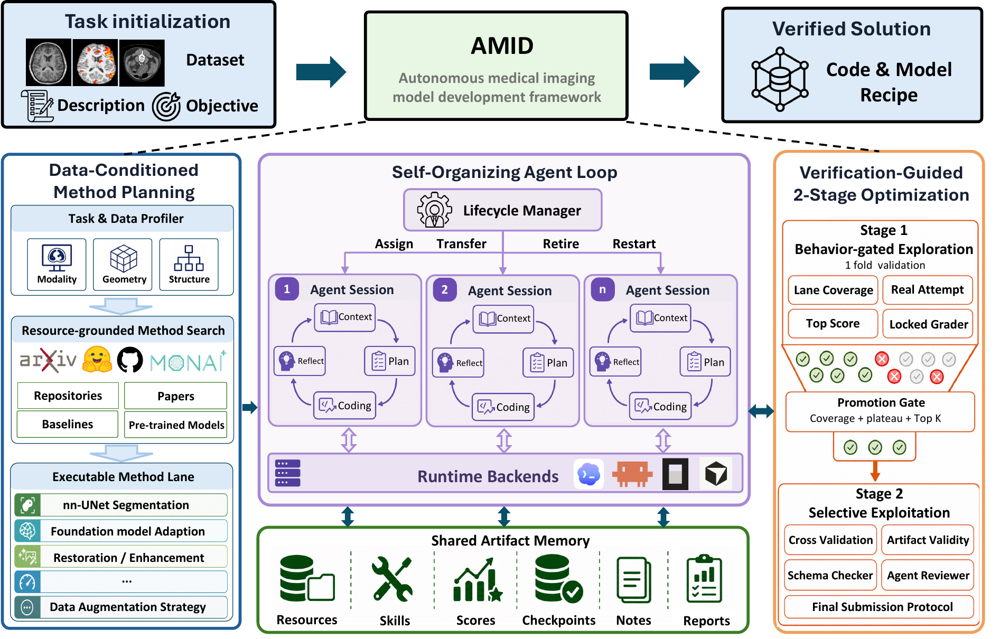

  

# AMID: Towards Autonomous Medical Imaging Model Development

<!-- 

  Shengyuan Liu1,*, Jia-Xuan Jiang1,*, Boyun Zheng1, Cheng Wang1, Wentao Pan1, Zipei Wang2, Houwen Peng5, Yu Gu3, Lichao Sun4,&dagger;, Yixuan Yuan1,&dagger;

 -->

<!-- 

  1The Chinese University of Hong Kong &nbsp;
  2Institute of Automation, Chinese Academy of Sciences &nbsp;
  3Microsoft Research &nbsp;
  4Lehigh University &nbsp;
  5Independent Researcher

 -->

<!-- 

  *Equal contribution &nbsp; &dagger;Corresponding author

 -->

## 🚀Overview

AMID is an autonomous multi-agent framework for medical imaging model development. Given a task definition and dataset, AMID builds task-specific model solutions through data-conditioned method planning, multi-agent optimization, and verification-guided final artifact selection.

AMID first profiles the task contract, modality, geometry, labels, metric, risks, and submission format. It then constructs executable method lanes grounded in medical-imaging resources and coordinates coding-agent workers through shared artifacts, validation evidence, checkpoints, notes, and reviewer reports. Final submissions are selected only after verification checks for validation protocol, metric computation, output schema, artifact completeness, and traceability.

## ✨ Todo List
- [ ] Release the AMID source code.
- [x] Release the AMID technical report.
- [x] Release the challenge-specific solution reports for all 20 ReX-MLE medical-imaging tasks.

## 📦Evaluation

The challenge benchmark used in this project comes from [ReX-MLE](https://github.com/rajpurkarlab/ReX-MLE), which including 20 medical-imaging challenge tasks.

| Challenge | Task Type | Primary Metric | AMID Score | Report |
|---|---|---:|---:|---|
| DENTEX | Detection | AP | 0.49 | [solution](solutions/dentex/) |
| ISLES'22 | Segmentation | Dice | 0.71 | [solution](solutions/isles22/) |
| LDCT-IQA | Image quality assessment | Score | 2.74 | [solution](solutions/ldct-iqa/) |
| NeurIPS-CellSeg | Segmentation | F1 | 0.90 | [solution](solutions/neurips-cellseg/) |
| PANTHER-T1 | Segmentation | Dice | 0.41 | [solution](solutions/panther-task1/) |
| PANTHER-T2 | Segmentation | Dice | 0.31 | [solution](solutions/panther-task2/) |
| PUMA-T1-Seg | Tissue segmentation | Dice | 0.56 | [solution](solutions/puma-track1-task1/) |
| PUMA-T1-Det | Nuclei detection | F1 | 0.54 | [solution](solutions/puma-track1-task2/) |
| PUMA-T2-Seg | Tissue segmentation | Dice | 0.56 | [solution](solutions/puma-track2-task1/) |
| PUMA-T2-Det | Nuclei detection | F1 | 0.28 | [solution](solutions/puma-track2-task2/) |
| SEG.A | Aortic vessel-tree segmentation | Dice | 0.91 | [solution](solutions/seg-a/) |
| TopBrain-CTA | CTA vessel segmentation | Mean Dice | 0.59 | [solution](solutions/topbrain-track1/) |
| TopBrain-MRA | MRA vessel segmentation | Mean Dice | 0.64 | [solution](solutions/topbrain-track2/) |
| TopCoW-CTA-Seg | CTA multi-class segmentation | Mean Dice | 0.63 | [solution](solutions/topcow-track1-task1/) |
| TopCoW-CTA-Det | CTA 3D box detection | IoU | 0.71 | [solution](solutions/topcow-track1-task2/) |
| TopCoW-CTA-Cls | CTA graph classification | Accuracy | 0.33 | [solution](solutions/topcow-track1-task3/) |
| TopCoW-MRA-Seg | MRA multi-class segmentation | Mean Dice | 0.76 | [solution](solutions/topcow-track2-task1/) |
| TopCoW-MRA-Det | MRA 3D box detection | IoU | 0.74 | [solution](solutions/topcow-track2-task2/) |
| TopCoW-MRA-Cls | MRA graph classification | Accuracy | 0.46 | [solution](solutions/topcow-track2-task3/) |
| USenhance | Ultrasound enhancement | LNCC | 0.19 | [solution](solutions/usenhance/) |

## 📝Citation
